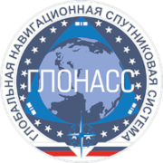

> ### QBIT u globalnom pozicioniranju !
> - gprs.
> - glonass.
> - gps.
> - gsm.

##### GPRS

> - GPRS (engl. General Packet Radio Service) je usluga koja je na raspolaganju korisnicima mobilnih telefona i omogućava im pristup internetu. Usluga omogućava teoretsku brzinu prenosa do oko 170 kB/s . Za razliku od linearnog prenošenja govora, ovde se podaci razlažu u pakete, koji se tek kod primaoca ponovo slažu u ispravnom redosledu.
U 2003. maksimalna brzina je bila 30—40 kB/s, dok je kašnjenje u minimumu variralo između 600—700 ms, ali je često prelazilo 1 sekund. Kjubit bi mogao tu da odigra glavnu ulogu svojom superpozicijom. Kjubiti u superpoziciji mogu biti svih 16 stanja u jednom trenutku. Ovi brojevi rastu eksponencijalno sa povećanjem broja kjubita, pa tako 20 njih mogu paralelno predstavljati milion vrednosti. To bi bio revolucionalni nenormalno brzi GPRS.

##### GLONASS

> - GLONASS (ruski: ГЛОбальная НАвигационная Спутниковая Система), doslovno: "globalni navigacijski satelitski sistem") je satelitski navigacijski sistem koji je 
započeo SSSR 1976. Po raspadu Sovjetskog Saveza, Rusija je preuzela projekat i on se trenutno nalazi u nadležnosti ruskih svemirskih snaga. Sistem je zamišljen 
kao mreža od 24 geostacionarna satelita koji metodom trilateracije definišu poziciju objekta na površini Zemlje i prijemniku šalju podatke o njegovoj poziciji.
GLONASS je završen tokom prve polovine devedesetih, no usled loše ekonomske situacije ubrzo posle završetka postao je gotovo nefunkcionalan. Ruska vlada je 2001. 
započela projekat modernizacije sistema u koji je uključena i Indijska vlada. GLONASS je 2010 pokrivao celu teritoriju Rusije a od oktobra 2011 pokriva i celu
planetu. I kod glonass-a superpozicija kjubita u 32 vrednosti može paralelno predstavljati milione vrednosti. Što bi bio napredak čitavog čovečanstva jer
bi glonass postao vodeći sistem navigacije. Dobili bi smo supersonične brzine koordinata u realnom vremenu.

##### GPS

> - U pripremi.

##### GSM

> - U pripremi
